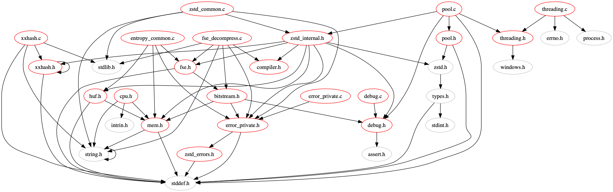
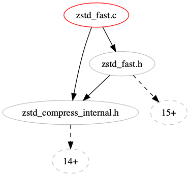

# cxx-dependencies
Various scripts to see the dependencies between Cxx source files.

Requirements:
1. python 2
2. ponyORM

```
$ python main.py -i zstd-dev/lib/common/ -r zstd-dev -n "example1" -o examples -d 999
```


```
$ python main.py -i zstd-dev/lib/compress/zstd_fast.c -r zstd-dev -n "example2" -o examples -d 999
```


```
$ python main.py -i zstd-dev/lib/compress/zstd_fast.c -r zstd-dev -n "example3" -o examples -d 1
```

