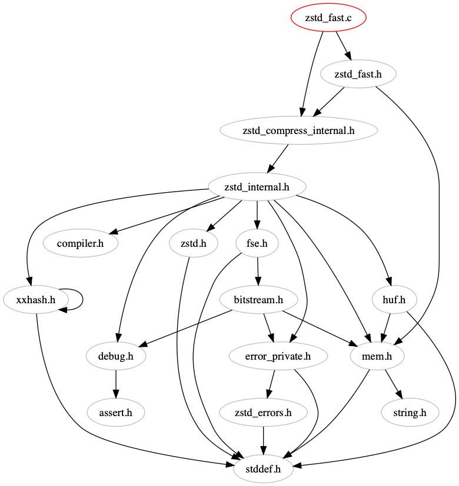

# cxx-dependencies
Various scripts to see the dependencies between Cxx source files.

Requirements:
1. python 2
2. ponyORM

```
$ python -m pip install pony
```

# `graph.py`

Draw dependencies graphs.

```
$ python graph.py -i zstd-dev/lib/common/ -r zstd-dev -n "example1" -o examples -d 999
```


```
$ python graph.py -i zstd-dev/lib/compress/zstd_fast.c -r zstd-dev -n "example2" -o examples -d 999
```


```
$ python graph.py -i zstd-dev/lib/compress/zstd_fast.c -r zstd-dev -n "example3" -o examples -d 1
```


# `includes.py`

How much headers does input file include in total (recursively)?

```
$ includes.py --system-headers -i zstd-dev/lib/decompress -r zstd-dev/lib
```

```
-----+---------------------------------------------------------------------------
  24 | /Users/quint/Downloads/zstd-dev/lib/decompress/zstd_decompress.c
  23 | /Users/quint/Downloads/zstd-dev/lib/decompress/zstd_ddict.c
  16 | /Users/quint/Downloads/zstd-dev/lib/decompress/zstd_decompress_block.c
  13 | /Users/quint/Downloads/zstd-dev/lib/decompress/zstd_decompress_block.h
  12 | /Users/quint/Downloads/zstd-dev/lib/decompress/zstd_decompress_internal.h
   8 | /Users/quint/Downloads/zstd-dev/lib/decompress/huf_decompress.c
   1 | /Users/quint/Downloads/zstd-dev/lib/decompress/zstd_ddict.h
-----+---------------------------------------------------------------------------
```

A full list of headers the input file includes (recursively).

```
$ includes.py -i zstd-dev/lib/decompress/zstd_decompress.c -r zstd-dev/lib --list
```

```
-----+------------------------------------------------------------------
  24 | /Users/quint/Downloads/zstd-dev/lib/decompress/zstd_decompress.c
-----+------------------------------------------------------------------
     | /Users/quint/Downloads/zstd-dev/lib/common/bitstream.h
     | /Users/quint/Downloads/zstd-dev/lib/common/compiler.h
     | /Users/quint/Downloads/zstd-dev/lib/common/cpu.h
     | /Users/quint/Downloads/zstd-dev/lib/common/debug.h
     | /Users/quint/Downloads/zstd-dev/lib/common/error_private.h
     | /Users/quint/Downloads/zstd-dev/lib/common/fse.h
     | /Users/quint/Downloads/zstd-dev/lib/common/huf.h
     | /Users/quint/Downloads/zstd-dev/lib/common/mem.h
     | /Users/quint/Downloads/zstd-dev/lib/common/xxhash.c
     | /Users/quint/Downloads/zstd-dev/lib/common/xxhash.h
     | /Users/quint/Downloads/zstd-dev/lib/common/zstd_errors.h
     | /Users/quint/Downloads/zstd-dev/lib/common/zstd_internal.h
     | /Users/quint/Downloads/zstd-dev/lib/decompress/zstd_ddict.h
     | /Users/quint/Downloads/zstd-dev/lib/decompress/zstd_decompress_block.h
     | /Users/quint/Downloads/zstd-dev/lib/decompress/zstd_decompress_internal.h
     | /Users/quint/Downloads/zstd-dev/lib/legacy/zstd_legacy.h
     | /Users/quint/Downloads/zstd-dev/lib/legacy/zstd_v01.h
     | /Users/quint/Downloads/zstd-dev/lib/legacy/zstd_v02.h
     | /Users/quint/Downloads/zstd-dev/lib/legacy/zstd_v03.h
     | /Users/quint/Downloads/zstd-dev/lib/legacy/zstd_v04.h
     | /Users/quint/Downloads/zstd-dev/lib/legacy/zstd_v05.h
     | /Users/quint/Downloads/zstd-dev/lib/legacy/zstd_v06.h
     | /Users/quint/Downloads/zstd-dev/lib/legacy/zstd_v07.h
     | /Users/quint/Downloads/zstd-dev/lib/zstd.h
-----+------------------------------------------------------------------
```

# `included_by.py`

How many files do include some particular header (recursively)?

```
$ included_by.py -i zstd-dev/lib
```

```
-----+---------------------------------------------------------------------------
  44 | /Users/quint/Downloads/zstd-dev/lib/common/zstd_errors.h
  43 | /Users/quint/Downloads/zstd-dev/lib/common/error_private.h
  38 | /Users/quint/Downloads/zstd-dev/lib/common/mem.h
  36 | /Users/quint/Downloads/zstd-dev/lib/common/debug.h
  33 | /Users/quint/Downloads/zstd-dev/lib/zstd.h
  32 | /Users/quint/Downloads/zstd-dev/lib/common/bitstream.h
  31 | /Users/quint/Downloads/zstd-dev/lib/common/fse.h
  30 | /Users/quint/Downloads/zstd-dev/lib/common/compiler.h
  29 | /Users/quint/Downloads/zstd-dev/lib/common/huf.h
  28 | /Users/quint/Downloads/zstd-dev/lib/common/xxhash.h
  25 | /Users/quint/Downloads/zstd-dev/lib/common/zstd_internal.h
  13 | /Users/quint/Downloads/zstd-dev/lib/compress/zstdmt_compress.h
  12 | /Users/quint/Downloads/zstd-dev/lib/compress/zstd_compress_internal.h
   6 | /Users/quint/Downloads/zstd-dev/lib/common/threading.h
   5 | /Users/quint/Downloads/zstd-dev/lib/compress/hist.h
   5 | /Users/quint/Downloads/zstd-dev/lib/common/pool.h
   4 | /Users/quint/Downloads/zstd-dev/lib/dictBuilder/zdict.h
   4 | /Users/quint/Downloads/zstd-dev/lib/decompress/zstd_decompress_internal.h
   4 | /Users/quint/Downloads/zstd-dev/lib/legacy/zstd_v03.h
   4 | /Users/quint/Downloads/zstd-dev/lib/legacy/zstd_v07.h
   4 | /Users/quint/Downloads/zstd-dev/lib/legacy/zstd_v04.h
   4 | /Users/quint/Downloads/zstd-dev/lib/legacy/zstd_v01.h
   4 | /Users/quint/Downloads/zstd-dev/lib/legacy/zstd_v05.h
   4 | /Users/quint/Downloads/zstd-dev/lib/legacy/zstd_v02.h
   4 | /Users/quint/Downloads/zstd-dev/lib/legacy/zstd_v06.h
   4 | /Users/quint/Downloads/zstd-dev/lib/common/cpu.h
   3 | /Users/quint/Downloads/zstd-dev/lib/compress/zstd_ldm.h
   3 | /Users/quint/Downloads/zstd-dev/lib/compress/zstd_double_fast.h
   3 | /Users/quint/Downloads/zstd-dev/lib/compress/zstd_fast.h
   3 | /Users/quint/Downloads/zstd-dev/lib/decompress/zstd_ddict.h
   3 | /Users/quint/Downloads/zstd-dev/lib/deprecated/zbuff.h
   2 | /Users/quint/Downloads/zstd-dev/lib/compress/zstd_lazy.h
   2 | /Users/quint/Downloads/zstd-dev/lib/compress/zstd_opt.h
   2 | /Users/quint/Downloads/zstd-dev/lib/dictBuilder/cover.h
   2 | /Users/quint/Downloads/zstd-dev/lib/dictBuilder/divsufsort.h
   2 | /Users/quint/Downloads/zstd-dev/lib/decompress/zstd_decompress_block.h
   2 | /Users/quint/Downloads/zstd-dev/lib/legacy/zstd_legacy.h
-----+---------------------------------------------------------------------------
```

Which files do include some particular header (recursively)?

```
$ included_by.py -i zstd-dev/lib/common/threading.h -r zstd-dev/lib --list
```

```
-----+--------------------------------------------------------
   6 | /Users/quint/Downloads/zstd-dev/lib/common/threading.h
-----+--------------------------------------------------------
     | /Users/quint/Downloads/zstd-dev/lib/common/pool.c
     | /Users/quint/Downloads/zstd-dev/lib/common/threading.c
     | /Users/quint/Downloads/zstd-dev/lib/compress/zstdmt_compress.c
     | /Users/quint/Downloads/zstd-dev/lib/dictBuilder/cover.c
     | /Users/quint/Downloads/zstd-dev/lib/dictBuilder/cover.h
     | /Users/quint/Downloads/zstd-dev/lib/dictBuilder/fastcover.c
-----+--------------------------------------------------------
```
